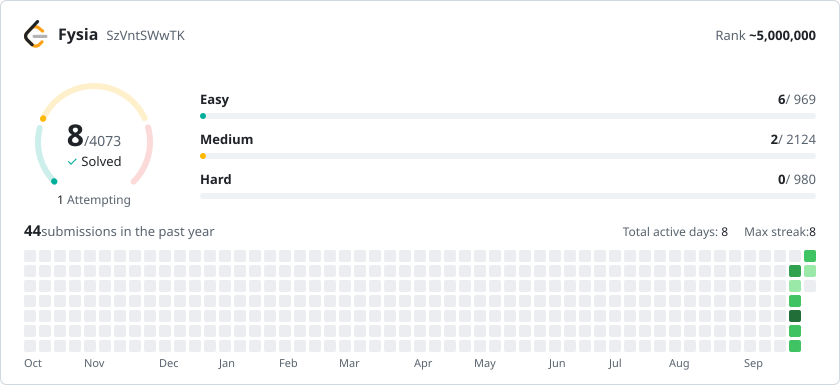

<h1 align="center">Hi, I'm Fyssia 👋</h1>

Backend developer working with Go

<h3 align="center">Backend</h3>

  

<h3 align="center">Infrastructure</h3>

  

<h3 align="center">Frontend</h3>

  

<h3 align="center">Environment</h3>

  

<h3 align="center">LeetCode</h3>
<a href="https://leetcode.com/u/SzVntSWwTK/">
  <picture>
    <source media="(prefers-color-scheme: dark)" srcset="assets/leetcode-dark.svg" />
    
  </picture>
</a>
